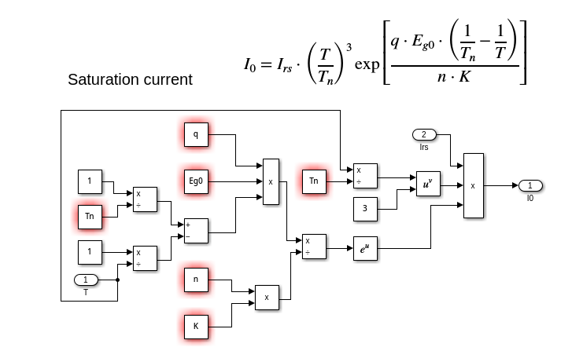
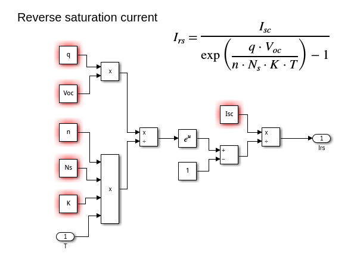
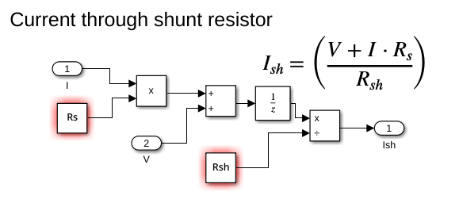
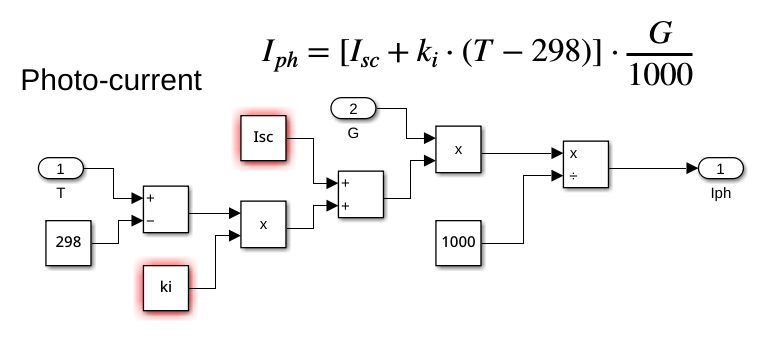

# Documentación del Modelo Simulink

## Descripción General

Este directorio contiene el modelo Simulink, pantallazos de los bloques del modelo, y los scripts de MATLAB utilizados para generar los cálculos y simular el comportamiento del panel solar.

## Contenido

- **models/**: Contiene el archivo del modelo Simulink (`sunset_pv.slx`).
- **screenshots/**: Contiene pantallazos de cada bloque del modelo Simulink.
- **scripts/**: Contiene el script de MATLAB (`data_pv.m`) utilizado para realizar los cálculos.
- **README.md**: Este archivo, que documenta los hallazgos y proporciona descripciones detalladas.

## Pantallazos de los Bloques

### Bloque 1: Ecuación de Corriente de Saturación



Ecuación:

\[ I_{0} = I_{rs} \cdot \left( \frac{T}{T_n} \right)^{3} \exp\left[ \frac{q \cdot E_{g0} \cdot \left( \frac{1}{T_n} - \frac{1}{T} \right) }{n \cdot K}\right] \]

Descripción:
Este bloque calcula la corriente de saturación inversa (\( I_{0} \)) en función de la temperatura (\( T \)), la energía del gap (\( E_{g0} \)), y otras constantes físicas.

### Bloque 2: Corriente de Saturación Inversa



Ecuación:

\[ I_{rs} = \frac{I_{sc}}{\exp\left( \frac{q \cdot V_{oc}}{n \cdot N_s \cdot K \cdot T} \right) - 1} \]

Descripción:
Este bloque calcula la corriente de saturación inversa (\( I_{rs} \)) en condiciones estándar de prueba, en función de la corriente de cortocircuito (\( I_{sc} \)) y el voltaje de circuito abierto (\( V_{oc} \)).

### Bloque 3: Corriente de Shunt



Ecuación:

\[ I_{sh} = \left( \frac{V + I \cdot R_s}{R_{sh}} \right) \]

Descripción:
Este bloque calcula la corriente de shunt (\( I_{sh} \)) que fluye a través de la resistencia de shunt (\( R_{sh} \)), en función del voltaje (\( V \)) y la corriente (\( I \)).

### Bloque 4: Foto Corriente



Ecuación:

\[ I_{ph} = \left[ I_{sc} + k_i \cdot \left( T - 298 \right) \right] \cdot \frac{G}{1000} \]

Descripción:
Este bloque calcula la foto corriente (\( I_{ph} \)) generada por el panel solar, en función de la corriente de cortocircuito (\( I_{sc} \)), el coeficiente de temperatura (\( k_i \)), la temperatura (\( T \)), y la irradiancia (\( G \)).

### Bloque 5: Otra Foto Corriente


Ecuación:

\[ I_{ph} = \left[ I_{sc} + k_i \cdot \left( T - 298 \right) \right] \cdot \frac{G}{1000} \]

Descripción:
Este bloque es similar al Bloque 4 y calcula la foto corriente (\( I_{ph} \)) con los mismos parámetros y ecuación.

### PV Module


Descripción:
Este bloque conecta todos los bloques mencionados anteriormente. `voltage_values` contiene un Sample time de 0.1.

## Script de MATLAB

El script `data_pv.m` se utiliza para simular el comportamiento del panel solar bajo diferentes condiciones. A continuación se muestra el contenido del script:

```matlab
% data_pv.m
% Descripción del script y cómo utilizarlo
% ...

% Ejemplo de uso:
Voc = 47.4;  % Tensión en circuito abierto (Voc)

% Crear un vector de voltaje con 100 valores desde 0 hasta Voc
voltage_values = linspace(0, Voc, 100)';

% Definir el tiempo de simulación
t = (0:0.1:99.9)';  % Ajustado para que tenga 100 puntos

% Definir las diferentes condiciones de entrada
temperatures = 15:5:55;
irradiances = 100:1000:1000;

% Inicializar una matriz para almacenar los resultados
results = [];

% Cargar el modelo
model = 'sunset_pv';
load_system(model);

% Dividir las combinaciones en bloques para evitar problemas de memoria
num_blocks = 2;
block_size = length(temperatures) * length(irradiances) / num_blocks;

parfor block_idx = 1:num_blocks
    block_results = [];
    for temp_idx = 1:length(temperatures)
        for irr_idx = 1:length(irradiances)
            temp = temperatures(temp_idx);
            irr = irradiances(irr_idx);
            
            % Mostrar el progreso
            disp(['Ejecutando simulación para temperatura = ', num2str(temp), ' °C, irradiancia = ', num2str(irr), ' W/m^2']);
            
            % Definir las señales de entrada para temperatura e irradiancia
            T = [t, temp * ones(size(t))];
            G = [t, irr * ones(size(t))];
            
            % Asignar las variables al espacio de trabajo base
            assignin('base', 'T', T);
            assignin('base', 'G', G);
            assignin('base', 'voltage_values', voltage_values);  % Asignar el vector de voltaje
            
            % Ejecutar la simulación
            simOut = sim(model);
            
            % Verificar si la salida de Simulink contiene los campos esperados
            if isfield(simOut, 'V') && isfield(simOut, 'I')
                % Obtener los resultados de la simulación
                voltage_data = simOut.V.signals.values;  % Acceder a los datos de voltaje
                current_data = simOut.I.signals.values;  % Acceder a los datos de corriente
                power_data = voltage_data .* current_data;  % Calcular la potencia
                
                % Crear una matriz temporal con los datos actuales
                temp_results = [voltage_data, current_data, power_data, temp * ones(size(voltage_data)), irr * ones(size(voltage_data))];
                
                % Concatenar los resultados actuales a la matriz de resultados del bloque
                block_results = [block_results; temp_results];
            else
                disp(['Simulink output does not contain expected fields for temperatura = ', num2str(temp), ' °C, irradiancia = ', num2str(irr), ' W/m^2.']);
            end
        end
    end
    
    % Concatenar los resultados del bloque a la matriz de resultados principal
    results = [results; block_results];
end

% Convertir la matriz de resultados a una tabla
results_table = array2table(results, 'VariableNames', {'Voltage', 'Current', 'Power', 'Temperature', 'Irradiance'});

% Guardar la tabla de resultados en un archivo CSV
writetable(results_table, 'simulation_results.csv');

% Cerrar el modelo
close_system(model, 0);
