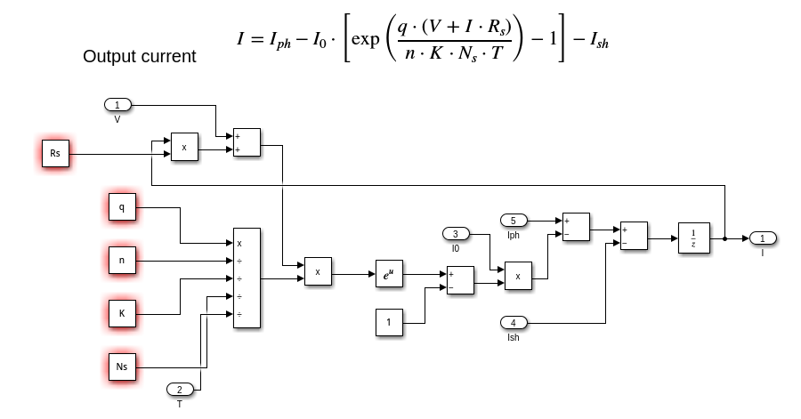

# Documentación del Modelo Simulink

## Descripción General

Este directorio contiene el modelo Simulink, pantallazos de los bloques del modelo, y los scripts de MATLAB utilizados para generar los cálculos y simular el comportamiento del panel solar.

## Contenido

- **models/**: Contiene el archivo del modelo Simulink (`sunset_pv.slx`).
- **screenshots/**: Contiene pantallazos de cada bloque del modelo Simulink.
- **scripts/**: Contiene el script de MATLAB ([`data_pv.m`](scripts/data_pv.m)) utilizado para realizar los cálculos.
- **data/**: Contiene el archivo CSV (`simulation_results.csv`) con los resultados de las simulaciones.
- **README.md**: Este archivo, que documenta los hallazgos y proporciona descripciones detalladas.

## Pantallazos de los Bloques

### Bloque 1: Ecuación de Corriente de Saturación

Ecuación:

\[ I_{0} = I_{rs} \cdot \left( \frac{T}{T_n} \right)^{3} \exp\left[ \frac{q \cdot E_{g0} \cdot \left( \frac{1}{T_n} - \frac{1}{T} \right) }{n \cdot K}\right] \]

Descripción:
Este bloque calcula la corriente de saturación inversa (\( I_{0} \)) en función de la temperatura (\( T \)), la energía del gap (\( E_{g0} \)), y otras constantes físicas.

### Bloque 2: Corriente de Saturación Inversa

Ecuación:

\[ I_{rs} = \frac{I_{sc}}{\exp\left( \frac{q \cdot V_{oc}}{n \cdot N_s \cdot K \cdot T} \right) - 1} \]

Descripción:
Este bloque calcula la corriente de saturación inversa (\( I_{rs} \)) en condiciones estándar de prueba, en función de la corriente de cortocircuito (\( I_{sc} \)) y el voltaje de circuito abierto (\( V_{oc} \)).

### Bloque 3: Corriente de Shunt

Ecuación:

\[ I_{sh} = \left( \frac{V + I \cdot R_s}{R_{sh}} \right) \]

Descripción:
Este bloque calcula la corriente de shunt (\( I_{sh} \)) que fluye a través de la resistencia de shunt (\( R_{sh} \)), en función del voltaje (\( V \)) y la corriente (\( I \)).

### Bloque 4: Foto Corriente

Ecuación:

\[ I_{ph} = \left[ I_{sc} + k_i \cdot \left( T - 298 \right) \right] \cdot \frac{G}{1000} \]

Descripción:
Este bloque calcula la foto corriente (\( I_{ph} \)) generada por el panel solar, en función de la corriente de cortocircuito (\( I_{sc} \)), el coeficiente de temperatura (\( k_i \)), la temperatura (\( T \)), y la irradiancia (\( G \)).

### Bloque 5: Otra Foto Corriente

Ecuación:

\[ I_{ph} = \left[ I_{sc} + k_i \cdot \left( T - 298 \right) \right] \cdot \frac{G}{1000} \]

Descripción:
Este bloque es similar al Bloque 4 y calcula la foto corriente (\( I_{ph} \)) con los mismos parámetros y ecuación.

### PV Module

Descripción:
Este bloque conecta todos los bloques mencionados anteriormente. `voltage_values` contiene un Sample time de 0.1.

## Script de MATLAB

El script `data_pv.m` se utiliza para simular el comportamiento del panel solar bajo diferentes condiciones. Puedes encontrar el script en la carpeta `scripts` o acceder directamente [aquí](scripts/data_pv.m).

## Resultados

### Archivo CSV: `simulation_results.csv`

El archivo `simulation_results.csv` contiene los resultados de las simulaciones realizadas con el modelo Simulink. Cada fila del archivo representa una combinación de condiciones de temperatura e irradiancia y contiene las siguientes columnas:

- **Voltage**: El voltaje en el panel solar.
- **Current**: La corriente generada por el panel solar.
- **Power**: La potencia calculada como el producto de la corriente y el voltaje.
- **Temperature**: La temperatura en la que se realizó la simulación.
- **Irradiance**: La irradiancia (intensidad de luz solar) en la que se realizó la simulación.

Estos datos permiten analizar cómo varía la corriente y la potencia generada por el panel solar bajo diferentes condiciones de temperatura e irradiancia.

### Ejemplo de Contenido del Archivo CSV

| Voltage | Current | Power | Temperature | Irradiance |
|---------|---------|-------|-------------|------------|
| 0       | 0       | 0     | 15          | 100        |
| 0.47    | 0.01    | 0.0047| 15          | 100        |
| ...     | ...     | ...   | ...         | ...        |
| 47.4    | 9.35    | 443.79| 55          | 1000       |

### Análisis de Resultados

El análisis de estos resultados permite evaluar el desempeño del panel solar en diversas condiciones ambientales y proporciona una base para la validación del modelo Simulink y la comparación con predicciones basadas en redes neuronales.

Para más detalles sobre los cálculos y la simulación, consulta el script [`data_pv.m`](scripts/data_pv.m).
